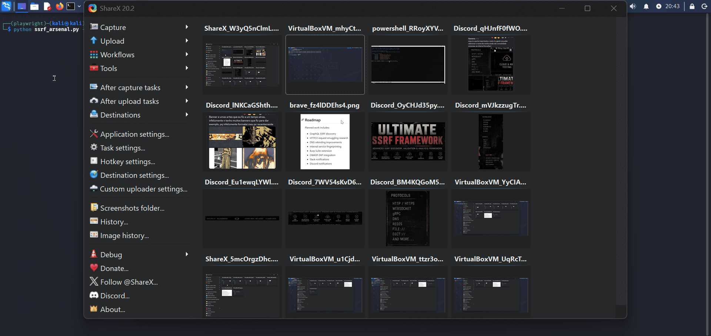

# Ultimate SSRF Framework v4.2 (Experimental)

## Demo:
<div align="center">



<br>


A research-focused SSRF testing framework built for bug bounty hunting, penetration testing and application security research.

</div>

---


> [!WARNING]
> This tool does not automatically prove impact. Findings should be manually validated before being reported.
Blind SSRF confirmation depends on external OAST/Collaborator logs.
Some modules are experimental and may produce false positives.

## About

Ultimate SSRF Framework started as a collection of SSRF testing scripts I used during bug bounty hunting.

As the project grew, I kept adding the things I found myself doing repeatedly: endpoint discovery, blind SSRF validation, cloud metadata testing, reporting and infrastructure fingerprinting.

The result is a framework that can handle most of the SSRF workflow from a single command line interface.

The main goal is to reduce repetitive work and make it easier to discover, validate and document SSRF findings.

---

## What it can do

Current capabilities include:

* Endpoint discovery and crawling
* Blind SSRF validation
* Cloud metadata testing
* WAF fingerprinting
* File-based target scanning
* Multi-target scanning
* WebSocket SSRF testing
* gRPC SSRF testing
* Kubernetes SSRF testing
* Serverless SSRF testing
* AI-assisted payload generation
* AI-assisted finding triage
* HTML reporting
* JSON reporting
* Nuclei export
* SIEM (CEF) export
* Attack map generation

Cloud testing currently supports:

* AWS
* Azure
* Google Cloud Platform
* Alibaba Cloud

---

## Installation

Clone the repository:

```bash
git clone https://github.com/KauanCosta2000/Ultimate-ssrf-Framework.git

cd Ultimate-ssrf-Framework
```

Install dependencies:

```bash
uv pip install -r requirements.txt
```

Install Playwright:

```bash
uv run playwright install chromium
```

Verify installation:

```bash
uv run ssrf_arsenal.py --help
```

Some Linux distributions, including Kali, block global `uv pip install` by default.
Using a virtual environment is recommended.

```bash
uv venv
source .venv/bin/activate
uv pip install -r requirements.txt
```

Or install it as a uv tool, which gives you the `ssrf-arsenal` command:

```bash
uv tool install git+github.com/KauanCosta2000/Ultimate-ssrf-Framework.git
```

For a local clone, run it with either:

```bash
uv run ssrf_arsenal.py --help
```

```bash
python ssrf_arsenal.py --help
```

If you installed it as a tool, run:

```bash
ssrf-arsenal --help
```

---

## Quick Start

Single target:

```bash
uv run ssrf_arsenal.py --target example.com
```

Multiple targets:

```bash
uv run ssrf_arsenal.py --targets api.example.com,test.example.com
```

Target file:

```bash
uv run ssrf_arsenal.py --target-file targets.txt
```

Blind SSRF callback:

```bash
uv run ssrf_arsenal.py \
--target example.com \
--callback your-callback.oastify.com
```

---

## CLI Reference

Display all available options:

```bash
uv run ssrf_arsenal.py --help
```

### Target Selection

```text
--target, -t           Single target domain
--targets              Comma-separated targets
--target-file, -f      File containing targets (one target per line)
```

### Callback / OAST

```text
--callback, -c         Out-of-band callback host
--collaborator         Alias for OAST callback host
--burp-collaborator    Burp Collaborator host
```

Example:

```bash
uv run ssrf_arsenal.py \
--target example.com \
--burp-collaborator abc123.burpcollaborator.net
```

### Proxy Support

```text
--proxy, -p            Single proxy URL
--proxy-file           File containing proxy list
--proxy-type           http | socks5
```

### AI Integration

```text
--ai-provider          claude | openai | ollama | gemini | mistral | deepseek | none
--ai-key               API key for cloud AI providers
--ai-model             Specific model name
```

## Built-in Payloads

The framework ships with a built-in SSRF payload list so you do not have to start every test from scratch.

By default, it uses safer payloads for common SSRF scenarios, including:

* Cloud metadata endpoints
* Localhost and loopback variants
* Internal network ranges
* Alternative IP formats
* DNS helper domains
* Read-only file protocol checks
* Basic gopher and dict probes
* OAST/callback-based validation

There is also an optional dangerous payload mode for more aggressive protocol payloads, such as Redis write attempts or SMTP DATA probes.

Dangerous payloads are disabled by default and should only be used in fully authorized environments:


### Feature Control

```text
--no-waf               Disable WAF detection
--no-websocket         Disable WebSocket SSRF tests
--no-grpc              Disable gRPC SSRF tests
--no-k8s               Disable Kubernetes SSRF tests
--no-serverless        Disable Serverless SSRF tests
--no-ai                Disable AI features
--dangerous-payloads   Enable dangerous/destructive SSRF payloads
```

### Export Options

```text
--export-nuclei        Export Nuclei templates
--export-siem          Export SIEM CEF report
--export-json-api      Export JSON API report
--attack-map           Generate attack path graph
--output, -o           Output directory
```

---

## Reporting

The framework can generate:

* HTML Reports
* JSON Reports
* Nuclei Templates
* SIEM CEF Exports
* Attack Maps

Use `--output` to specify where generated files should be saved:

```bash
uv run ssrf_arsenal.py \
--target example.com \
--output reports \
--export-nuclei \
--export-siem \
--export-json-api \
--attack-map
```

Generated files may include:

```text
reports/
 - ssrf_example.com_YYYYMMDD_HHMMSS.json
 - ssrf_report_example.com_YYYYMMDD_HHMMSS.html
 - nuclei_example.com.yaml
 - siem_example.com.cef
 - api_report_example.com.json
 - attack_map_example.com.gexf
```

Full example:

```bash
uv run ssrf_arsenal.py \
--target example.com \
--callback your-callback.oastify.com \
--output reports \
--export-nuclei \
--export-siem \
--export-json-api \
--attack-map
```

---

## Docker

Build:

```bash
docker build -t ultimate-ssrf-framework .
```

Run:

```bash
docker run --rm ultimate-ssrf-framework \
--target example.com
```

Target file:

```bash
docker run --rm ultimate-ssrf-framework \
--target-file targets.txt
```

---

## Development Status

This project is actively maintained and new modules are added whenever I find interesting SSRF research areas worth exploring.

Current research-focused modules include:

* WebSocket SSRF
* gRPC SSRF
* Kubernetes SSRF
* Serverless SSRF
* AI-assisted workflows

Some of these features are still evolving and will continue to improve over future releases.

---

## Roadmap

Planned work includes:

* GraphQL SSRF discovery
* HTTP/2 request smuggling research
* DNS rebinding improvements
* Internal service fingerprinting
* Burp Suite extension
* OWASP ZAP integration
* Slack notifications
* Discord notifications

---

## Contributing

Bug reports, pull requests and research ideas are always welcome.

Please review:

* CONTRIBUTING.md
* SECURITY.md

before opening a pull request.

---

## Author

Developed by Belladonnask

GitHub:
https://github.com/KauanCosta2000

LinkedIn: 
https://www.linkedin.com/in/kauan-costa-105b12345/

MIT License © Kauan Costa

---

## Disclaimer

This project is intended for authorized security testing, research and educational purposes only.

Use responsibly.
